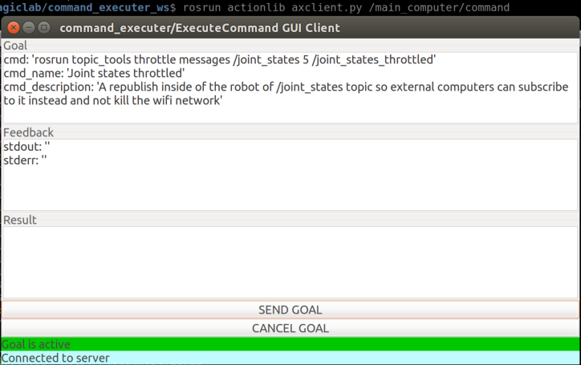

# command_executer

Server to execute terminal commands on the machine it is running.

The server keeps tracks of the commands so you can check the stdout, stderr and kill them.

It also publishes feedback on what commands are being executed and have been executed.

Offers an action server and a string topic interface to execute commands.

Useful for automating launching nodes/services/scripts from code in different machines
or to boot up a robot with a set of software. (So you don't need to SSH into the robot for that!).

**Note**: No security involved, it will execute any given command.

**Note2**: You can launch one as root and use it for remote device reboots, for example 
when a bluetooth card gets stuck. (I know this would be very NOT recommended, but it works).

# Usage

Make a launch file and give the node a well thought name:
```xml
<launch>
    <node pkg="command_executer" name="main_computer" type="cmd_exec.py" output="screen">
        <!-- Check commands status every given seconds -->
        <param name="check_commands_interval" value="0.1" />
        <!-- Publish status of the commands every given seconds -->
        <param name="publish_status_interval" value="1.0" />
        <!-- How long to keep publishing an old finished command in the
             status in seconds -->
        <param name="status_finished_commands_lifetime" value="120.0" />
        <!-- How many characters maximum you want published in the status
                topic for the stdout field. -->
        <param name="status_stdout_max_characters" value="200" />
        <!-- How many characters maximum you want published in the status
                topic for the stderr field. -->
        <param name="status_stderr_max_characters" value="200" />
    </node>
</launch>
```

When launched you can either send a command to be executed and track it with action server
interface or with the topic interface if you don't need to track it or you'll track it
from the status publishing interface.

# Example of usage

With the node launched, for example the provided launchfile:

```bash
roslaunch command_executer command_executer.launch
```

You'll see the topics:

```
/main_computer/cancel_command
/main_computer/command/cancel
/main_computer/command/feedback
/main_computer/command/goal
/main_computer/command/result
/main_computer/command/status
/main_computer/commands_status
/main_computer/execute_command
```

Where the action server interface is `/main_computer/command` of type `command_executer/ExecuteCommand`. The topic interface is `/main_computer/execute_command` of type `std_msgs/String` and the cancel interface with also type `std_msgs/String`. And finally the feedback topic `/main_computer/commands_status` of type `command_executer/CommandExecuterStatus`.

## Action interface

You can try with:

```
rosrun actionlib axclient.py /main_computer/command
```

And for example run the command:
```yaml
cmd: 'rosrun topic_tools throttle messages /joint_states 5 /joint_states_throttled'
cmd_name: 'Joint states throttled'
cmd_description: 'A republish inside of the robot of /joint_states topic so external computers can subscribe to it instead and not kill the wifi network'
```



If you now cancel the goal, the process will be killed. If you kill the process, the action server
will reflect that on the feedback and result interfaces.

A killed command would return a result like:

```
success: False
ret_val: 143
stdout: ''
stderr: Terminated
```

## Topic interface

You can send a `std_msgs/String` with your command to `/main_computer/execute_command` like:

```bash
rostopic pub /main_computer/execute_command std_msgs/String "rostopic pub -1 /activate_something std_msgs/Bool True" -1
```

You can cancel it using the `std_msgs/String` topic cancel interface `/main_computer/cancel_command`, for that you'll need to know the name of your command (not the exact command). You can retrieve that from the feedback topic `/main_computer/commands_status`.

```bash
rostopic echo /main_computer/commands_status
active_cmds: 
  - 
    cmd: rostopic pub -1 /activate_something std_msgs/Bool True
    cmd_name: rostopic_pub_-1_/activate_something_std_msgs/Bool_True_from_topic_idx_0
    cmd_description: Command from the topic interface.
    stdout: ''
    stderr: ''
    ret_val: -1
    time_running: 
      secs: 2
      nsecs: 211001873
finished_cmds: []
```

The field `cmd_name` is the one that matters, in this case you could cancel the command with:

```
rostopic pub /main_computer/cancel_command std_msgs/String "data: 'rostopic_pub_-1_/activate_something_std_msgs/Bool_True_from_topic_idx_0'"
```

As you can see this is more of a easy-to-use hacky interface.

## Command status topic

Just subscribe to the topic `/main_computer/commands_status` and you'll get the self explanatory output:

```
active_cmds: 
  - 
    cmd: rosrun topic_tools throttle messages /joint_states 5 /joint_states_throttled
    cmd_name: Joint states throttled
    cmd_description: A republish inside of the robot of /joint_states topic so external computers can subscribe to it instead and not kill the wifi network
    stdout: ''
    stderr: ''
    ret_val: -1
    time_running: 
      secs: 13
      nsecs: 238414049
finished_cmds: 
  - 
    cmd: rostopic pub -1 /activate_something std_msgs/Bool True
    cmd_name: rostopic_pub_-1_/activate_something_std_msgs/Bool_True_from_topic_idx_1
    cmd_description: Command from the topic interface.
    stdout: publishing and latching message for 3.0 seconds

    stderr: ''
    ret_val: 0
    time_running: 
      secs: 3
      nsecs: 540158987
```

# Load a bunch of commands from yaml file
You can load commands on batch by using the `commands_from_yaml.py` script with a YAML file
containing a list of `command_executer/ExecuteCommandGoal`.

For example:

```
rosrun command_executer commands_from_yaml.py /main_computer/command `rospack find command_executer`/config/initial_commands.yaml
```

Or in a launch file:

```xml
<launch>
    <node pkg="command_executer" name="boot_commands" type="commands_from_yaml.py"
        args="/main_computer/command $(find command_executer)/config/initial_commands.yaml"
        output="screen"/>
</launch>
```
